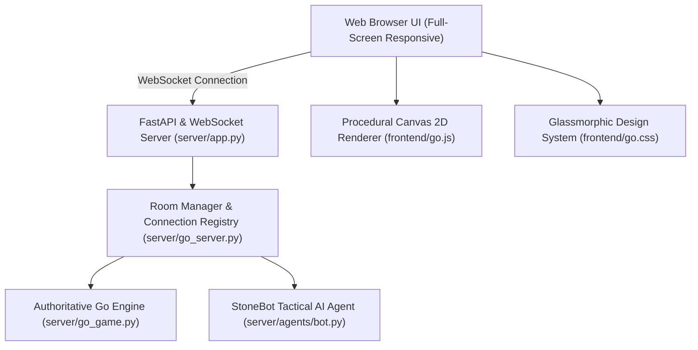

# 🗻 StoneSync — Project Architecture & GitHub Build Roadmap

This document outlines the complete architectural modularization and task breakdown to build **StoneSync** from scratch using its full-screen UI layout, procedural canvas board renderer, direct side switcher, real-time WebSocket room manager, and heuristic AI engine.

---

## 📐 System Architecture Diagram

---

## 🛠️ GitHub Tasks & Core Modules

### 📍 Task 1: Authoritative Go Game Rules Engine (`server/go_game.py`)
- **Objective**: Build a pure Python Go rule engine capable of validating legal moves, tracking group liberties, removing captured stones, enforcing the suicide rule and Ko state, and calculating territory scores with Komi & Handicap support.
- **Key Deliverables**:
  - `place_stone(r, c, color)` with liberty propagation.
  - `pass_turn(color)` & game-over scoring logic.
  - `resign(color)` & match statistics dict exporter.
  - Comprehensive unit test suite in `server/test_go_game.py`.

---

### 📍 Task 2: Procedural HTML5 2D Canvas & Vector Renderer (`frontend/go.js`)
- **Objective**: Create a zero-image, vector-based Go board rendering engine utilizing HTML5 2D Canvas.
- **Key Deliverables**:
  - Procedural wood texture & theme shaders (`Kaya Wood`, `Obsidian`, `Cyberpunk`).
  - Radial gradient stone drawing (specular reflections, drop shadows).
  - Star point vectors, hover intersection previews, coordinate grid text.
  - Coordinate translation helper `getIntersectionFromCoords(x, y)`.

---

### 📍 Task 3: Full-Screen Layout Shell & Side Switcher UI (`frontend/go.html` & `frontend/go.css`)
- **Objective**: Build a responsive `100vw` dark glassmorphic web UI with interactive side switcher controls.
- **Key Deliverables**:
  - `.app-wrapper` full-width viewport shell with `1fr 400px` fluid main layout.
  - Top navbar segmented pill side switcher (`⚫ Black | ⚪ White | 🛠️ Both`).
  - Active turn telemetry badge, capture counters, and time control display.
  - Theme selector dropdown & SGF export modal.

---

### 📍 Task 4: WebSocket Room Manager & Multi-Role Permissioning (`server/go_server.py`)
- **Objective**: Manage WebSocket client connections across isolated room instances and enforce role permissions.
- **Key Deliverables**:
  - Room state synchronization & broadcast loop.
  - Role assignment (`B`, `W`, `observer`, `debug`).
  - Real-time `switch_side` action handler.
  - Deep-link query parameter parsing (`room`, `mode`, `board_size`, `komi`, `handicap`, `tc`).

---

### 📍 Task 5: Tournament Time Control System (`server/go_game.py` & `frontend/go.js`)
- **Objective**: Implement server-authoritative time controls (`Absolute`, `Fischer`, `Byo-yomi`) with real-time client countdown clocks.
- **Key Deliverables**:
  - Delta timestamp elapsed calculation `now_ts - last_move_timestamp`.
  - Period deduction logic for Byo-yomi and increment addition for Fischer.
  - Client-side urgent clock highlight (`clock-urgent`) and timeout victory trigger.

---

### 📍 Task 6: StoneBot Tactical AI Agent (`server/agents/bot.py`)
- **Objective**: Implement a heuristic tactical Go bot that automatically responds to player moves in single-player or practice rooms.
- **Key Deliverables**:
  - Immediate capture detector & self-defense saving moves.
  - Eye-space protection & territory expansion heuristics.
  - Automated AI turn triggering on turn switch.

---

### 📍 Task 7: Social Room Features & Web Audio Feedback Engine (`frontend/go.js` & `scripts/gen_sounds.py`)
- **Objective**: Add real-time room chat, floating emoji canvas reactions, and procedural sound feedback.
- **Key Deliverables**:
  - Capped message history broadcast (50 items max).
  - Floating emoji CSS animation layer over board canvas.
  - Procedural Web Audio API sound synthesis (placement pitch modulation, spatial panning, capture click).
