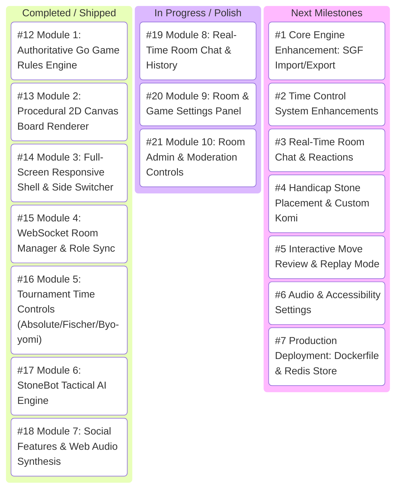

# 🗺️ GitHub Project: syncstone — Master Roadmap & Task Tracker

**Repository**: [`Archon-Phi/stonesync`](https://github.com/Archon-Phi/stonesync)  
**Project Name**: `syncstone`  
**Status**: Active Production Roadmap  

---

## 📊 Kanban Status Board

---

## 🛠️ Complete Issue Index & Roadmap Tracking

| Status | Issue ID | Module / Task Title | GitHub Link |
| :---: | :--- | :--- | :--- |
| ✅ **Done** | `#12` | `[Module 1 - Core Engine]` Authoritative Go Game Rules Engine | [#12](https://github.com/Archon-Phi/stonesync/issues/12) |
| ✅ **Done** | `#13` | `[Module 2 - Canvas Renderer]` Procedural 2D Canvas & Vector Themes | [#13](https://github.com/Archon-Phi/stonesync/issues/13) |
| ✅ **Done** | `#14` | `[Module 3 - Full-Screen UI]` Responsive 100vw Shell & Segmented Controls | [#14](https://github.com/Archon-Phi/stonesync/issues/14) |
| ✅ **Done** | `#15` | `[Module 4 - Room Manager]` WebSocket Lifecycle & Role Permissioning | [#15](https://github.com/Archon-Phi/stonesync/issues/15) |
| ✅ **Done** | `#16` | `[Module 5 - Time Controls]` Tournament Time Control System | [#16](https://github.com/Archon-Phi/stonesync/issues/16) |
| ✅ **Done** | `#17` | `[Module 6 - StoneBot AI]` Heuristic Tactical AI Opponent | [#17](https://github.com/Archon-Phi/stonesync/issues/17) |
| ✅ **Done** | `#18` | `[Module 7 - Social & Audio]` Room Chat, Emoji & Web Audio | [#18](https://github.com/Archon-Phi/stonesync/issues/18) |
| 🔄 **Active** | `#19` | `[Module 8 - Room Chat]` Real-Time Chat & History Persistence | [#19](https://github.com/Archon-Phi/stonesync/issues/19) |
| 🔄 **Active** | `#20` | `[Module 9 - Settings Panel]` Room & Game Settings Configuration UI | [#20](https://github.com/Archon-Phi/stonesync/issues/20) |
| 🔄 **Active** | `#21` | `[Module 10 - Admin Panel]` Room Admin & Moderation Controls | [#21](https://github.com/Archon-Phi/stonesync/issues/21) |
| 📌 **Backlog** | `#1` | Core Engine Enhancement: Add SGF Import/Export | [#1](https://github.com/Archon-Phi/stonesync/issues/1) |
| 📌 **Backlog** | `#2` | Time Control System: Add Byo-yomi & Fischer Controls | [#2](https://github.com/Archon-Phi/stonesync/issues/2) |
| 📌 **Backlog** | `#3` | Real-Time Room Chat & Reactions | [#3](https://github.com/Archon-Phi/stonesync/issues/3) |
| 📌 **Backlog** | `#4` | Handicap Stone Placement & Custom Komi | [#4](https://github.com/Archon-Phi/stonesync/issues/4) |
| 📌 **Backlog** | `#5` | Interactive Move Review & Replay Mode | [#5](https://github.com/Archon-Phi/stonesync/issues/5) |
| 📌 **Backlog** | `#6` | Audio & Accessibility Settings (Mute / Volume Control) | [#6](https://github.com/Archon-Phi/stonesync/issues/6) |
| 📌 **Backlog** | `#7` | Production Deployment: Dockerfile & Redis State Store | [#7](https://github.com/Archon-Phi/stonesync/issues/7) |
