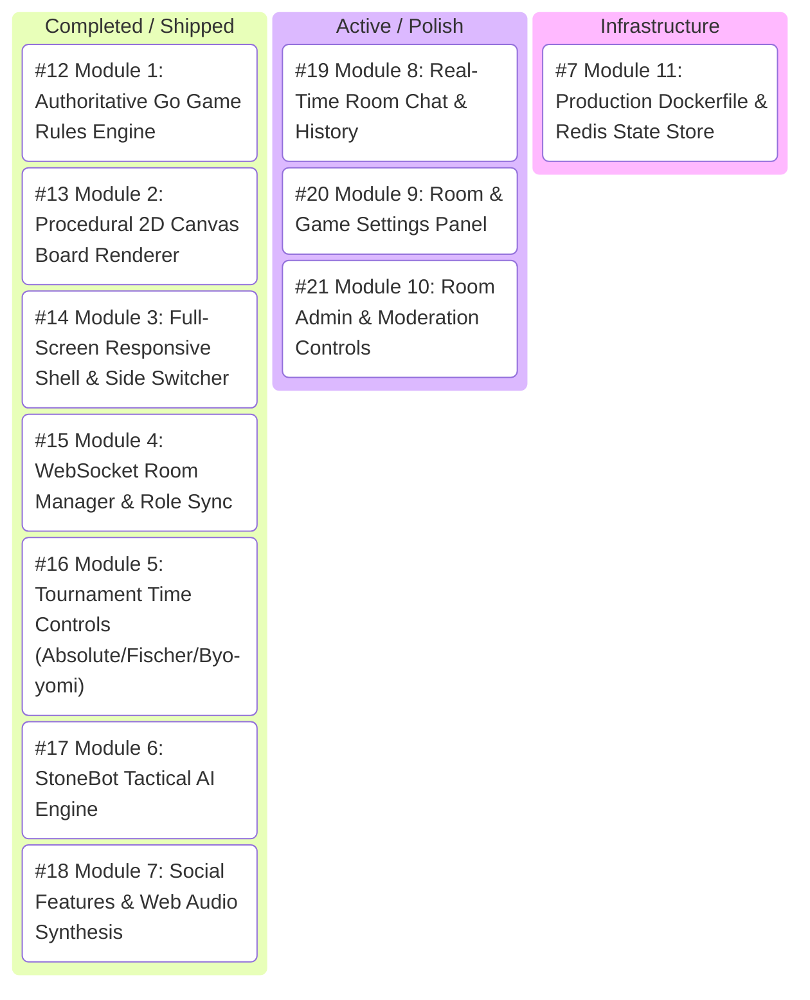

# 🗺️ GitHub Project: syncstone — Master Roadmap & Task Tracker

**Repository**: [`Archon-Phi/stonesync`](https://github.com/Archon-Phi/stonesync)  
**Project Name**: `syncstone`  
**Status**: Active Production Roadmap  

---

## 📊 Restructured Module Roadmap

---

## 🛠️ Restructured GitHub Issue Index

| Status | Issue ID | Module / Task Title | GitHub Link |
| :---: | :--- | :--- | :--- |
| ✅ **Closed** | `#12` | `[Module 1 - Core Engine]` Authoritative Go Game Rules Engine | [#12](https://github.com/Archon-Phi/stonesync/issues/12) |
| ✅ **Closed** | `#13` | `[Module 2 - Canvas Renderer]` Procedural 2D Canvas & Vector Themes | [#13](https://github.com/Archon-Phi/stonesync/issues/13) |
| ✅ **Closed** | `#14` | `[Module 3 - Full-Screen UI]` Responsive 100vw Shell & Segmented Controls | [#14](https://github.com/Archon-Phi/stonesync/issues/14) |
| ✅ **Closed** | `#15` | `[Module 4 - Room Manager]` WebSocket Lifecycle & Role Permissioning | [#15](https://github.com/Archon-Phi/stonesync/issues/15) |
| ✅ **Closed** | `#16` | `[Module 5 - Time Controls]` Tournament Time Control System | [#16](https://github.com/Archon-Phi/stonesync/issues/16) |
| ✅ **Closed** | `#17` | `[Module 6 - StoneBot AI]` Heuristic Tactical AI Opponent | [#17](https://github.com/Archon-Phi/stonesync/issues/17) |
| ✅ **Closed** | `#18` | `[Module 7 - Social & Audio]` Room Chat, Emoji & Web Audio | [#18](https://github.com/Archon-Phi/stonesync/issues/18) |
| 🔄 **Active** | `#19` | `[Module 8 - Room Chat]` Real-Time Chat & History Persistence | [#19](https://github.com/Archon-Phi/stonesync/issues/19) |
| 🔄 **Active** | `#20` | `[Module 9 - Settings Panel]` Room & Game Settings Configuration UI | [#20](https://github.com/Archon-Phi/stonesync/issues/20) |
| 🔄 **Active** | `#21` | `[Module 10 - Admin Panel]` Room Admin & Moderation Controls | [#21](https://github.com/Archon-Phi/stonesync/issues/21) |
| 🏗️ **Infra** | `#7` | `[Module 11 - Infrastructure]` Production Dockerfile & Redis Store | [#7](https://github.com/Archon-Phi/stonesync/issues/7) |
